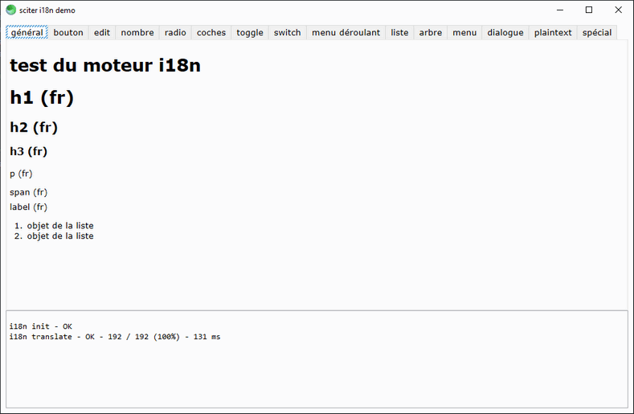

# sciter i18n

This is an attempt to create a translation engine for [sciter.js](https://sciter.com/) on top of [i18next](https://www.i18next.com/).



## demo

- git clone the repository
- run `install.bat` to download the latest sciter binaries and the sciter package manager
- install packages `php spm.phar install`
- fix vendor path in `src\i18n.js` from `import i18next from "../../../i18next/i18next/src/index.js";` to `import i18next from "../vendor/i18next/i18next/src/index.js";`
- run `scapp.bat`
- to refresh the app after changes to the html/css click `F5`

## install

- add the `src` dir to your project
- add to script

```js
<script type="module">

import {i18n} from "src/i18n.js";

document.on("ready", function() {
    // initialize translation engine
    const locale = "fr";
    const file   = sys.cwd() + `\\locales\\${locale}.json`;
    const debug  = true;

    if (i18n.init(locale, file, debug)) {
        console.log("i18n init - OK");

        // translate window
        i18n.i18n(document);
    }
    else
        console.error("i18n init - FAILED");
});
```

- create translation file `locales\fr.json`

```json
{
    "translation": {
        "key1": "test du moteur i18n"
    }
}
```

- then in the html code add attribute `data-i18n` to all elements you want translated. If `data-i18n` value is set then it will be used as the translation key.

```html
<h1 data-i18n="key1">i18n engine test</h1>
```

- otherwise the element's `innerHTML` will be the key

```html
<h1 data-i18n>h1</h1>
```

- translate in code

```js
// with 2 arguments, first serves as key, second as default value (better option)
let message = i18n.m("no-update", "Widget could not be updated.");

// with a single argument, it's both the key and the default value
let message = i18n.m("Widget could not be updated.");
```

# todo

- go through (nodes instead of innerHtml)[https://sciter.com/forums/topic/menu-items-innerhtml-recursive-update/]
- i18next file system backend or fetch backend
- add missing ids to json
- how to deal with interface refresh?

